## Reto 1 ux

###### 1. Elige una web de tu preferencia y explica qué partes conforman el UX y qué partes el UI

* [Pinterest](https://www.pinterest.es)
___
#### Pinterest:

### ux:
* Fácil Inicio de sección a la pagina al ofrecerle al usuario diferentes opciones de acceso : correo electrónico, cuenta de facebook ó Google.

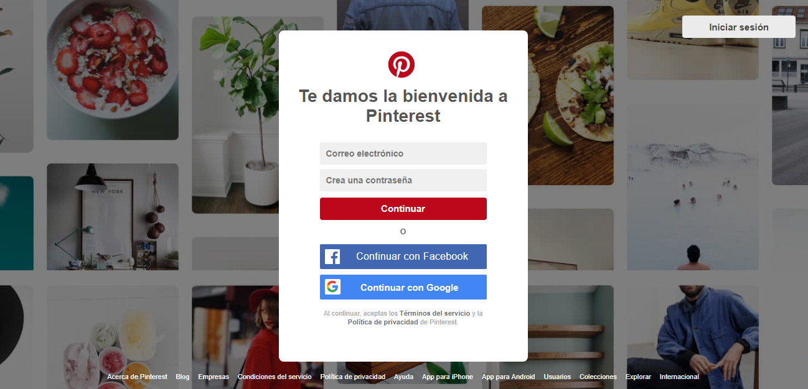
* Visualizacíon y ubicación al buscador de la pagina de manera sencilla  para el usuario, donde se puede realizar una busqueda rápida.

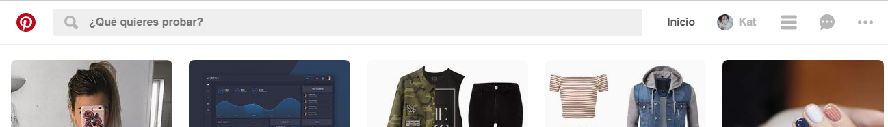

* Al comenzar a realizar la busqueda, se despliega un sección donde se pueden visualizar y clickear las  busquedas realizadas recientemente como ayuda al usuario.

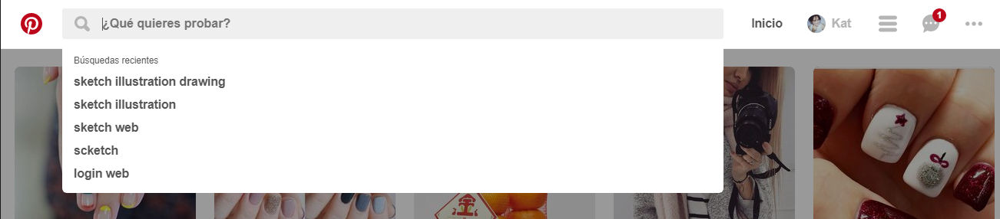
* se muestran también diferentes filtro de ayuda para el autocompletado de la busqueda.

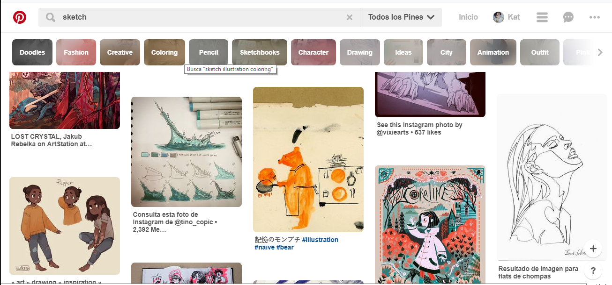
* Facilita al usuario el poder compartir en sus redes sociales o contactos en la web su busqueda sin necesidad de acceder a la imagen.  

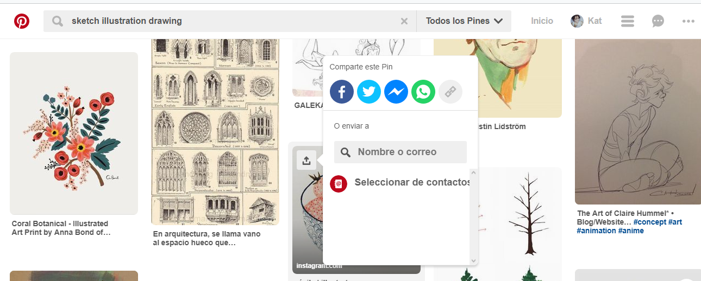
* Al acceder a la imagen nos proporciona un botón acceso en el cual el usuario puede clickear y este lo direccionará en una ventana emergente al sitio original de donde proviene la imagen.  

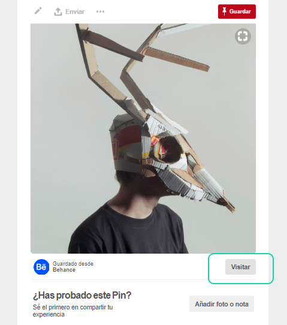  
* En la parte inferior de la busqueda del usuario se muestran más opciones relacionadas con la busqueda realizada.

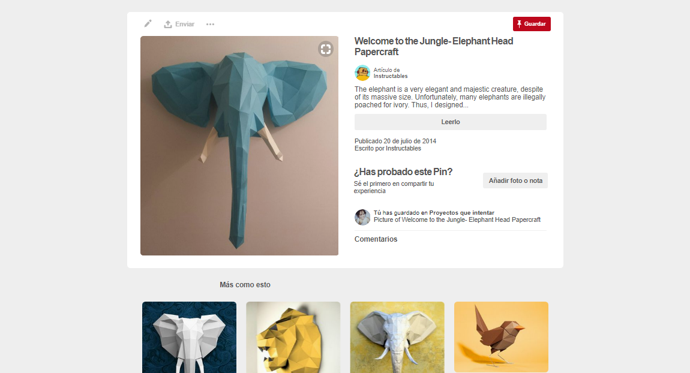
* Al guardar la imagen nos permite seleccionar tableros con categoría en las que el usuario desee guardar la imagen.

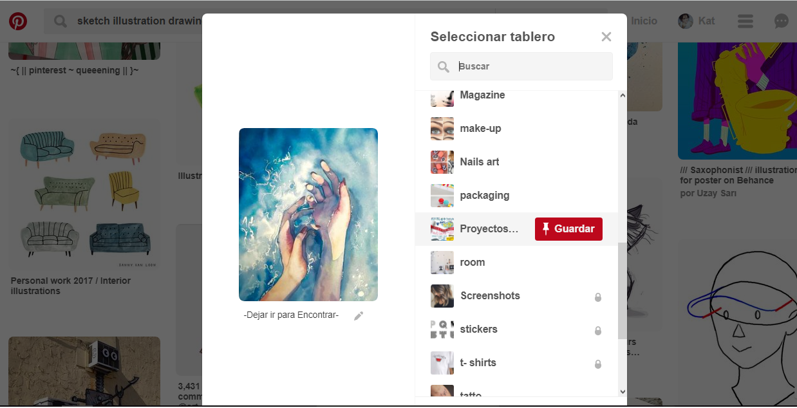
* Muestra también un mensaje de aviso, si es que el usuario ya ha guardo esa imagen antes, y especifica en que tablero la guardo.

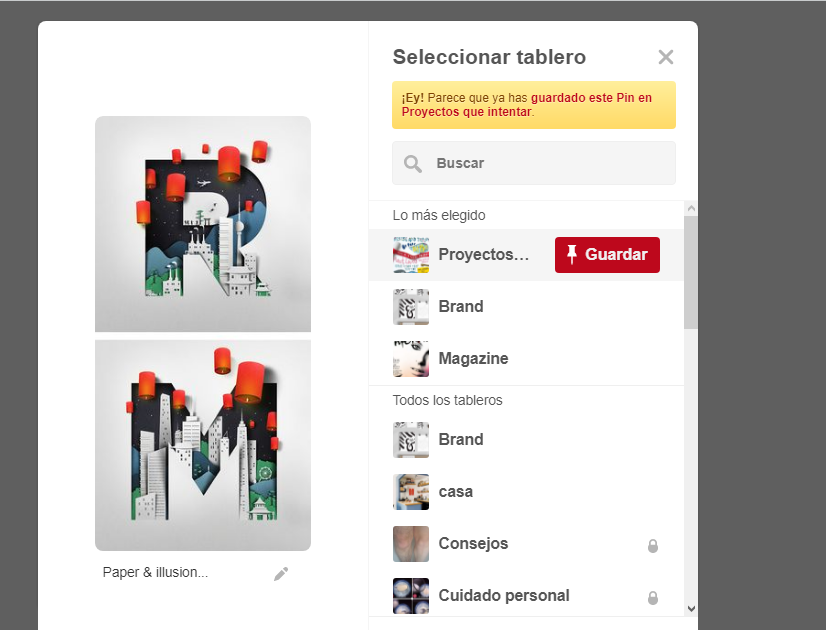
* Permite la interacción de otros usuarios mediantes un chat incluido en la web.

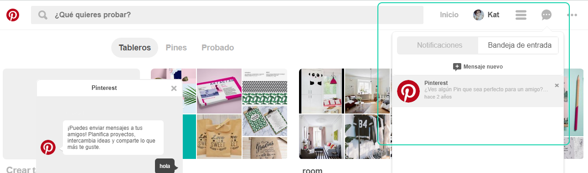

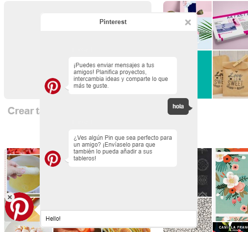
* Permite ver al usuario de forma organizada las imágenes que el guardo mediante tableros, a los cuales puede visualizar al acceder a su perfil.

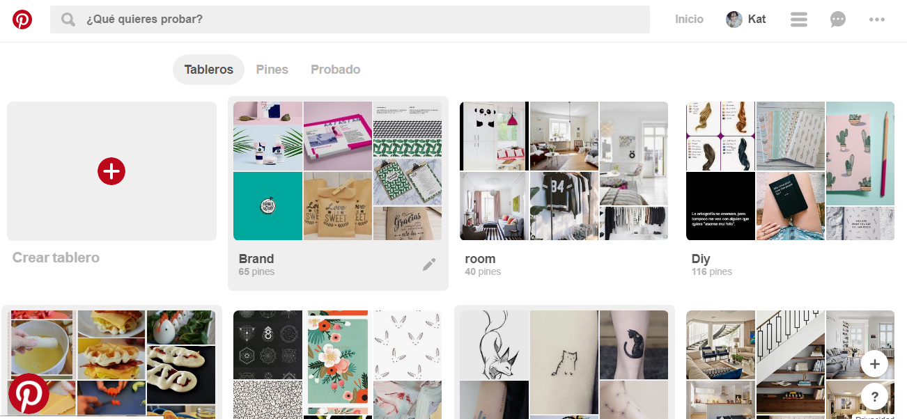
* Permite el usuario ver a quien sigue y quienes siguen sus perfil.

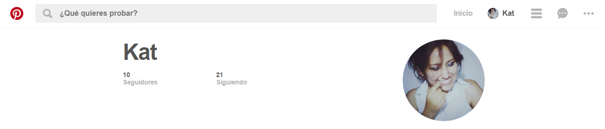

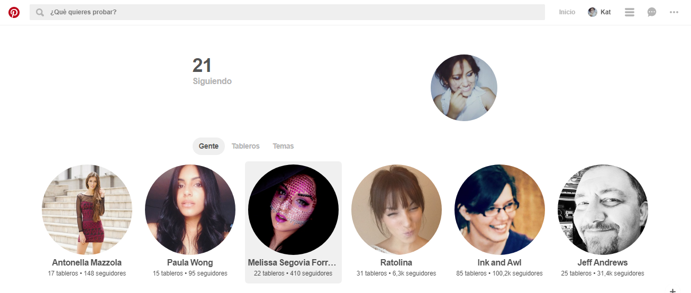

### ui:
* Usar en el diseño una gama cromática acorde con los colores corporativos de la web Pinterest (rojo y blanco)
* Probar diferentes colores, tamaños y textos en botones de la página.
* texturas y fondos usados en los botones de sugerencia de busqueda.
* Elección de la tipografía adecuada para la web (tamaño, color) y el uso adecuada dependiendo del fondo sobre le que se use.
* Diseño de los iconos e fondo y forma donde va ir las imágenes incluidas en la web.
* Diseño de la ventana emergente de previsualización de la imagen.
* Diseño de los menús y barra de navegación.
___
## Contenido

Este proyecto contiene:

1. Un archivo  **`README.md`** que explica el contenido del repositorio.

2. Una carpeta `img` donde se encuentran las imagenes usadas en el trabajo en formato **png**.

## Autora
Kattia Rojas Arohuanca.

## Fecha
26/11/2017
